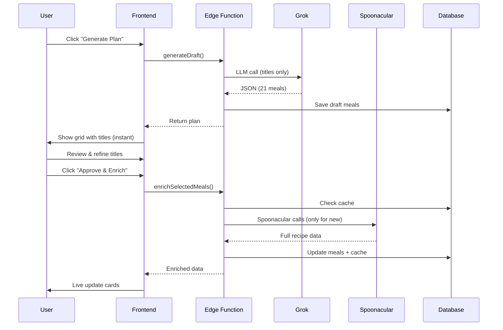
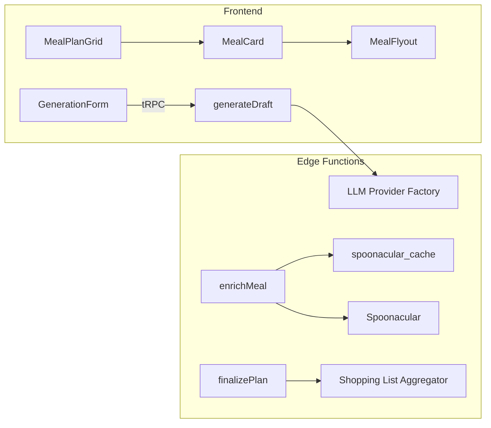

**PlanPlate — Complete End-to-End Architecture Document**  
**Version 1.3** | *Senior AI-Native Architect Review*  
**Date**: April 19, 2026  
**Status**: Production-Ready for PoC → Scale

---

### 1. Executive Summary

**PlanPlate** is a modern, AI-first web application that helps busy households (especially families) generate personalized, varied weekly meal plans in seconds. 

It combines:
- A powerful LLM (Grok for PoC) acting as a “PhD nutritionist”
- Real recipe data and nutrition from Spoonacular
- Progressive, user-controlled UX (see titles instantly, refine, then enrich)

**Core Philosophy**:
- Ship fast with high-quality AI (vibe coding + strong architecture)
- Keep token + API costs extremely low
- Design for seamless upgrade from Supabase Free → Pro
- Single LLM call + user-in-the-loop (no over-engineered multi-agent system)

**Key Differentiator**: Users see a complete draft plan in < 2 seconds, then control exactly which meals get enriched with real recipes.

---

### 2. Tech Stack & Architectural Principles

| Layer              | Technology                                      | Rationale |
|--------------------|--------------------------------------------------|---------|
| **Frontend**       | Vite + React 19 + TypeScript + Tailwind + shadcn/ui + TanStack Query + React Router | Fast DX, excellent DX, type-safe |
| **Backend**        | Supabase (PostgreSQL + Auth + Edge Functions + Realtime) | Zero-ops backend, built-in auth, RLS |
| **Hosting**        | Netlify (frontend) + Supabase (all backend)     | Global CDN + serverless |
| **API Layer**      | tRPC + Zod                                      | End-to-end type safety, no REST boilerplate |
| **LLM**            | Grok (xAI) via OpenAI-compatible SDK (`https://api.x.ai/v1`) | Excellent JSON adherence + creative titles for PoC |
| **Multi-LLM**      | Strategy + Factory pattern (ready for Claude 3.5 Sonnet / GPT-4o-mini) | Future-proof |
| **External API**   | Spoonacular (enrichment only)                   | Best-in-class recipe + nutrition data |
| **State**          | TanStack Query + Supabase Realtime (light)      | Optimistic UI + live updates |

**Guiding Principles**:
- Everything stateful lives in Postgres (idempotent & restart-safe)
- LLM does planning; Spoonacular does execution
- User is always in control (no black-box generation)
- Free-tier friendly → production scale with zero code changes

---

### 3. High-Level System Architecture

```mermaid
flowchart TB
    subgraph Client["Browser (Netlify)"]
        UI[React + shadcn/ui<br/>MealPlanGrid + Flyout]
        TRPC[tRPC Client]
    end

    subgraph Supabase["Supabase Platform"]
        AUTH[Auth + RLS]
        DB[(PostgreSQL<br/>+ spoonacular_cache)]
        EDGE[Edge Functions<br/>(Node 20)]
        REALTIME[Realtime (optional)]
    end

    subgraph External["External Services"]
        GROK[Grok API<br/>https://api.x.ai/v1]
        SPOON[Spoonacular API]
    end

    UI --> TRPC
    TRPC --> EDGE
    EDGE --> GROK
    EDGE --> SPOON
    EDGE --> DB
    DB --> REALTIME
    REALTIME -.-> UI
```

---

### 4. Complete Database Schema

```sql
-- Profiles
create table profiles (
  id uuid primary key references auth.users,
  full_name text,
  created_at timestamptz default now()
);

-- Households
create table households (
  id uuid primary key default gen_random_uuid(),
  user_id uuid references auth.users not null,
  name text not null,
  cooking_skill_level text check (cooking_skill_level in ('beginner','intermediate','advanced')),
  appliances jsonb default '[]',
  created_at timestamptz default now()
);

-- Household Members
create table household_members (
  id uuid primary key default gen_random_uuid(),
  household_id uuid references households on delete cascade,
  name text not null,
  dietary_preferences text[] default '{}',
  allergies text[] default '{}',
  avoidances text[] default '{}',
  diet_type text,
  created_at timestamptz default now()
);

-- Meal Plans
create table meal_plans (
  id uuid primary key default gen_random_uuid(),
  user_id uuid references auth.users not null,
  household_id uuid references households not null,
  title text not null,
  start_date date not null,
  num_days int default 7,
  generation_status text default 'draft' check (generation_status in ('draft','enriching','finalized')),
  shopping_list jsonb,
  llm_provider text,
  llm_model text,
  created_at timestamptz default now(),
  updated_at timestamptz default now()
);

-- Meals
create table meals (
  id uuid primary key default gen_random_uuid(),
  meal_plan_id uuid references meal_plans on delete cascade,
  day_of_week text not null,
  meal_type text not null check (meal_type in ('breakfast','lunch','dinner')),
  title text not null,
  short_description text,
  rationale text,
  status text default 'draft' check (status in ('draft','enriched')),
  spoonacular_recipe_id bigint,
  ingredients jsonb,
  nutrition jsonb,
  instructions text[],
  image_url text,
  is_favorite boolean default false,
  llm_provider text,
  tokens_used int,
  created_at timestamptz default now()
);

-- Spoonacular Cache (critical for cost control)
create table spoonacular_cache (
  spoonacular_recipe_id bigint primary key,
  title text,
  ingredients jsonb,
  nutrition jsonb,
  instructions text[],
  image_url text,
  cached_at timestamptz default now()
);

-- Favorite Meals (cross-plan reuse)
create table favorite_meals (
  id uuid primary key default gen_random_uuid(),
  user_id uuid references auth.users not null,
  title text,
  spoonacular_recipe_id bigint,
  ingredients jsonb,
  nutrition jsonb,
  instructions text[],
  image_url text,
  created_at timestamptz default now()
);
```

**RLS Policies**: Every table has `user_id` or `household_id` → `auth.uid()` checks.

---

### 5. AI & LLM Layer (Grok + Multi-Provider Ready)

**Current (PoC)**: Single Grok call via OpenAI-compatible SDK.

**Architecture**:
- `llm/` folder with strategy pattern
- Environment variable `LLM_PROVIDER=grok`
- All prompts stored in version-controlled files
- Structured JSON enforced with Zod + `response_format: { type: 'json_object' }`
- Temperature: 0.7 for creative titles, 0.2 for validation

**No Multi-Agent Decision** (confirmed):
We use **one high-quality LLM call** for the entire plan. A future “Critic Agent” (second cheap call) can be added later if quality feedback requires it. Per-meal agents are explicitly rejected for cost, latency, and consistency reasons.

**Prompt Strategy**:
- System: “You are a registered dietitian and PhD nutritionist…”
- Strict constraints injection (allergies, appliances, skill level)
- Output: Exact JSON schema only
- Post-processing validation in Edge Function (keyword + logic checks)

---

### 6. Core Workflows (Detailed)

**1. generateDraft(householdId, config)**
- Builds compact prompt
- Grok returns 21 structured meal objects (title + short_description + rationale)
- Server validates against allergies/avoidances
- Creates `meal_plan` + 21 `meals` (status = draft)
- Returns in < 2 seconds → user sees full grid immediately

**2. User Refinement Phase (Client)**
- Edit title, regenerate single meal, delete, favorite
- All changes saved optimistically via tRPC

**3. enrichSelectedMeals(mealIds[])**
- For each meal: check `spoonacular_cache` first
- If miss → Spoonacular `complexSearch` + `getRecipeInformation`
- Upsert to cache + update meal row (status = enriched)
- Can run in parallel (max 5 at a time to respect free-tier limits)

**4. finalizePlan(mealPlanId)**
- Server aggregates shopping list (original units + de-duplication)
- Stores in `meal_plans.shopping_list`
- Sets `generation_status = 'finalized'`

---

### 7. Frontend Component Architecture

```
/src
├── components/
│   ├── meal-plan/
│   │   ├── MealPlanGrid.tsx          (7×3 responsive grid)
│   │   ├── MealCard.tsx              (title + status + actions)
│   │   ├── MealFlyout.tsx            (full recipe + nutrition + export)
│   │   └── GenerationForm.tsx
├── hooks/
│   ├── useGenerateDraft.ts
│   ├── useEnrichMeal.ts
│   └── useFinalizePlan.ts
├── lib/
│   ├── trpc.ts
│   └── llm-types.ts
└── app/
    ├── dashboard/
    ├── household/
    └── plan/[id]/
```

---

### 8. Performance, Cost & Scaling Strategy

**Free Supabase Plan (PoC)**:
- 500k Edge invocations/month → easily supports 50–100 active users
- 150s duration → more than enough (our calls are < 8s)
- Design mitigations: on-demand enrichment, client retry logic, DB state

**Production Upgrade Path**:
- Zero code changes required
- Just flip `LLM_PROVIDER` and increase concurrency
- Optional later: add `job_queue` table + worker pattern only if > 5k daily generations

**Cost Controls**:
- Aggressive Spoonacular caching
- Token logging on every meal
- User-controlled enrichment (they decide how many to enrich)

---

### 9. Security & Safety Guardrails

- Row Level Security on every table
- LLM prompt contains explicit safety rules
- Post-LLM validation layer (rejects forbidden ingredients)
- No raw user input sent to Spoonacular without sanitization
- All API keys stored in Supabase Edge Function secrets

---

### 10. Deployment & DevOps

- **Frontend**: Netlify (auto-deploy from Git)
- **Backend**: Supabase Edge Functions (git-based deploy via Supabase CLI)
- **Environment**: `.env` with `XAI_API_KEY`, `SPOONACULAR_API_KEY`, `LLM_PROVIDER`
- **CI/CD**: GitHub Actions → Supabase deploy + Netlify deploy
- **Monitoring**: Supabase logs + simple token usage dashboard (future)

---

### 11. Mermaid Diagrams

**Generation Flow**



**Component Diagram**



---

### 12. Future Roadmap (Post-PoC)

- v1.5: Add lightweight Critic Agent (optional second LLM call for balance scoring)
- v2.0: Household sharing + collaborative editing
- v2.5: Macro target input + automatic calorie/macro balancing
- v3.0: Image generation for meals (Grok Imagine or Flux)

---